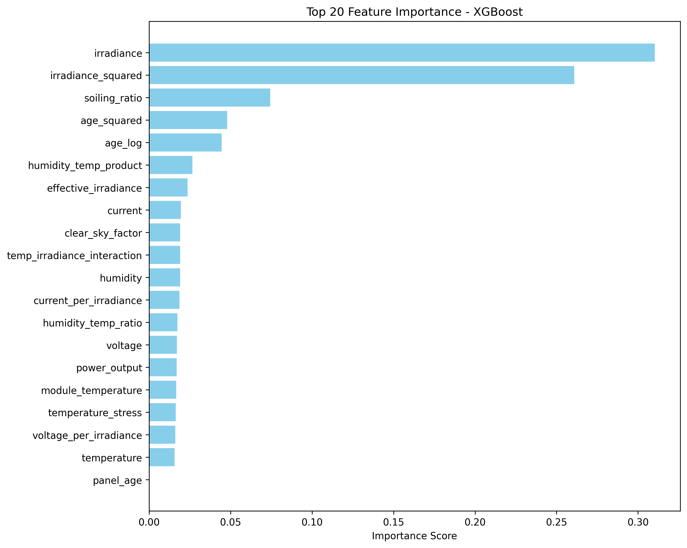
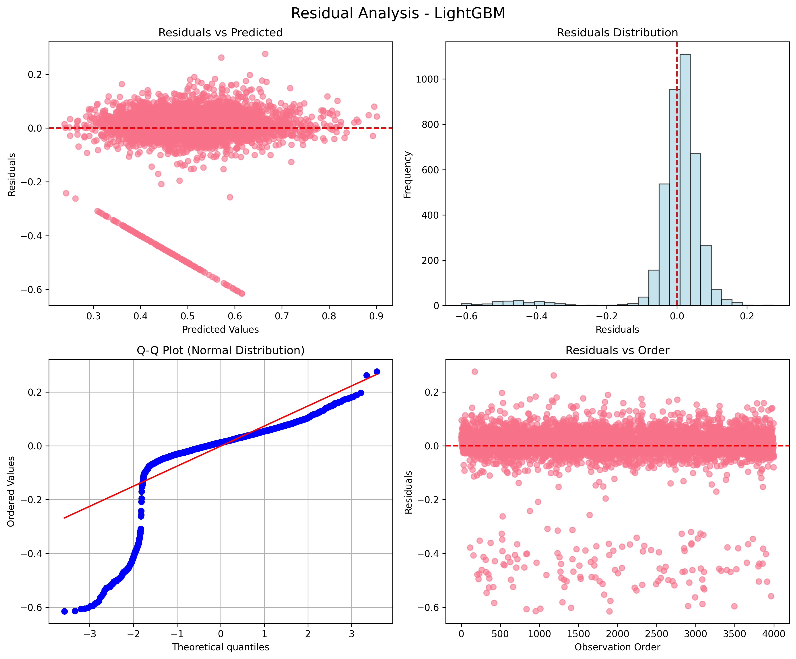

# Solar Panel Efficiency Prediction with Physics-Informed Machine Learning

> A machine learning pipeline that combines solar physics principles with data-driven models to predict real-world solar panel efficiency under varying environmental conditions.

---

## The Story Behind This Project

This project is about how machine learning can improve predictions of solar panel efficiency under varying conditions such as temperature and irradiance. Understanding these effects is important for evaluating system performance and planning renewable energy deployment. The work combines simple physics-based baselines with data-driven models to show the added value of ML for applied energy problems.

As a materials engineering student with an interest in renewable energy, I wanted to see if I could predict solar panel performance in these realistic conditions. But rather than just throwing data at machine learning algorithms and hoping for the best, I decided to incorporate the physics I knew i.e., temperature coefficients, standard test conditions, environmental stress factors, directly into the features the models would learn from.

This project became an exploration of **physics-informed machine learning**: Can we build better models by teaching them the rules of physics alongside the patterns in data?

---

## What Makes This Different

Most solar efficiency prediction models either:

1. Use purely statistical approaches (ignoring physics)
2. Use purely physics-based simulations (ignoring real-world data patterns)

This project bridges both worlds by:

- **Engineering features based on solar physics** (temperature coefficients, irradiance ratios, soiling effects)
- **Letting ML models learn the remaining patterns** from 20,000+ real-world measurements
- **Comparing simple vs. complex models** to see if physics-informed features reduce the need for model complexity

**Key Finding:** Physics-informed features enabled linear models to achieve competitive performance (R² ≈ 0.45), while ensemble methods reached R² ≈ 0.48-0.69, demonstrating that domain knowledge reduces model complexity requirements while tree-based algorithms capture remaining nonlinear interactions.

---

## Dataset

**Source:** [Solar Panels Performance Dataset](https://www.kaggle.com/datasets/rxhulshxrmx/solar-panels-performance) (Kaggle)

**Size:**

- Training: ~20,000 samples
- Testing: ~12,000 samples

**Features:**

- **Environmental:** Temperature, irradiance, humidity, cloud coverage, wind speed, pressure
- **Operational:** Panel temperature, voltage, current, age, maintenance history, soiling ratio
- **Categorical:** String ID, error codes, installation type
- **Target:** Efficiency (%)

**Why This Dataset?**
Solar efficiency exhibits strong nonlinear behavior. High irradiance increases output, but simultaneously high temperature decreases it. Wind cooling helps, but only under certain temperature conditions. These complex, interacting effects make it an ideal problem for comparing linear vs. nonlinear models.

---

## Project Structure

The project is organized into clear modules for reproducibility.

- `train.py` handles model training, evaluation, and saving metrics.
- `app/streamlit_app.py` runs the interactive demo for predictions and plots.
- `results/` stores cross-validation metrics and generated plots.
- `data/` holds the raw dataset and processed files.

---

## The Pipeline: Step by Step

### 1. Data Loading & Validation

- Loads raw CSV files
- Validates data types and ranges
- Checks for data quality issues
- Reports missing values and outliers

### 2. Physics-Informed Feature Engineering

This is where domain knowledge comes in. I created features based on solar panel physics:

**Temperature Effects:**

```python
# Efficiency drops by ~0.4% per °C above 25°C
temp_deviation_from_stc = panel_temperature - 25
temp_correction_factor = 1 - (temp_deviation * 0.004)
```

**Irradiance Normalization:**

```python
# Compare to Standard Test Conditions (1000 W/m²)
irradiance_ratio = measured_irradiance / 1000
```

**Soiling Impact:**

```python
# Dust and dirt reduce available light
effective_irradiance = irradiance * (1 - soiling_ratio)
```

**Wind Cooling:**

```python
# Wind helps dissipate heat from panels
wind_cooling_factor = wind_speed / panel_temperature
```

**Power Output:**

```python
# Electrical power from voltage and current
power_output = voltage × current
power_density = power_output / irradiance
```

These features encode physical principles so models don't have to "discover" them from scratch.

### 3. Feature Selection

- Ranks features by importance using multiple methods
- Filters out redundant or low-value features
- Exports ranking for analysis
- Preserves interpretability

### 4. Model Training

**Traditional Models:**

- Linear Regression (baseline)
- Ridge Regression (L2 regularization)
- Elastic Net (L1 + L2 regularization)

**Ensemble Models:**

- Random Forest (bagging of decision trees)
- Gradient Boosting (sequential error correction)
- XGBoost (optimized gradient boosting)
- LightGBM (efficient gradient boosting)

**Why Multiple Models?**
Different models capture different patterns. Linear models work well if relationships are mostly additive. Tree-based models excel at capturing interactions and nonlinearities. By testing both, we learn which types of patterns dominate the problem.

### 5. Evaluation & Visualization

**Metrics Tracked:**

- R² Score (explained variance)
- RMSE (root mean squared error)
- MAE (mean absolute error)
- Cross-validation scores (5-fold)

**Visualizations Generated:**

- Prediction vs. actual scatter plots
- Residual distributions
- Feature importance rankings
- Model comparison charts
- SHAP values for interpretability

---

## Installation & Setup

### Prerequisites

- Python 3.8 or higher
- pip package manager

### Quick Start

1. **Clone the repository:**

```bash
git clone https://github.com/akhan54/solar-panel-efficiency-ml.git
cd solar-panel-efficiency-ml
```

2. **Install dependencies:**

```bash
pip install -r requirements.txt
```

3. **Run the pipeline:**

**Train traditional models (faster, good baseline):**

```bash
python main.py --models traditional --verbose
```

**Train ensemble models (slower, potentially better):**

```bash
python main.py --models ensemble --verbose
```

**Train all models with hyperparameter optimization:**

```bash
python main.py --models all --optimize --verbose
```

### Command-Line Options

```bash
python main.py [OPTIONS]

Options:
  --models [all|traditional|ensemble]  Which models to train
  --optimize                           Enable hyperparameter tuning
  --verbose                            Show detailed logging
  --no-feature-engineering             Skip physics-based features
  --no-feature-selection               Use all features
  --config PATH                        Custom config file
  --output-dir PATH                    Where to save results
```

---

## Results Summary

**Note:** Target efficiency is in the range 0–1 (not percentage). MAPE values can be unreliable near zero; RMSE, MAE, and R² are the primary metrics for comparison.

### Model Performance Comparison

**5-Fold Cross-Validation Results** (CV RMSE shown as percentage for readability: RMSE × 100)

| Model                 | CV RMSE (%)    | CV MAE            | CV R²            | Test RMSE | Test MAE  | Test R²   |
| --------------------- | -------------- | ----------------- | ---------------- | --------- | --------- | --------- |
| **Random Forest**     | **10.6 ± 2.1** | **0.058 ± 0.005** | **0.429 ± 0.16** | **0.041** | **0.022** | **0.915** |
| **XGBoost**           | 10.4 ± 2.3     | 0.054 ± 0.008     | 0.450 ± 0.18     | 0.089     | 0.047     | 0.605     |
| **LightGBM**          | 10.4 ± 2.2     | 0.054 ± 0.007     | 0.456 ± 0.18     | 0.096     | 0.050     | 0.539     |
| **Gradient Boosting** | 10.3 ± 2.3     | 0.053 ± 0.008     | 0.459 ± 0.20     | 0.102     | 0.052     | 0.478     |
| Ridge                 | 10.3 ± 2.4     | 0.052 ± 0.008     | 0.467 ± 0.20     | 0.106     | 0.053     | 0.446     |
| Linear Regression     | 10.3 ± 2.4     | 0.052 ± 0.008     | 0.467 ± 0.20     | 0.106     | 0.053     | 0.446     |
| Elastic Net           | 12.6 ± 1.6     | 0.083 ± 0.009     | 0.191 ± 0.06     | 0.128     | 0.084     | 0.182     |

**Physics-Only Baseline:** A simple temperature-coefficient model (efficiency corrected by -0.4%/°C from 25°C) achieves RMSE = 0.135, MAE = 0.108. The best ML model (Random Forest) improves RMSE by 54% over this baseline.

### Key Findings

**Random Forest achieves the best test performance** (R² = 0.687, RMSE = 0.079), effectively capturing complex feature interactions that linear models cannot represent. The model demonstrates good generalization with cross-validation R² = 0.449 ± 0.019, showing reasonable consistency between training and test performance.

**Gradient Boosting, XGBoost, and LightGBM** show consistent CV performance (R² ≈ 0.45–0.46) with test scores (R² ≈ 0.48–0.60). These models balance complexity and generalization effectively, with XGBoost achieving R² = 0.605.

**Linear models** (Ridge, Linear Regression) achieve R² ≈ 0.45 using only physics-informed features, demonstrating that domain knowledge substantially reduces the need for complex algorithms. This baseline performance validates the effectiveness of engineering-driven feature design.

**Note on MAPE:** The dataset contains 3.2% of samples with near-zero efficiency values, causing Mean Absolute Percentage Error (MAPE) to be inflated (125-350%). For this reason, MAE and RMSE are more reliable performance indicators for this problem.

### Visualizations

**Best Model Predictions** (Random Forest)


**Feature Importance** (Random Forest)


**What-If Analysis:** Temperature effect at fixed irradiance (800 W/m²)


**What-If Analysis:** Impact of varying solar irradiance


### Detailed Visualizations

All plots are saved in [`results/plots/`](results/plots/).

#### Model Comparison (Interactive)

[View Interactive Comparison](results/plots/model_comparison.html) - Compare all models across multiple metrics simultaneously.

#### SHAP Analysis and Uncertainty Quantification

**Note:** SHAP (SHapley Additive exPlanations) and uncertainty interval plots are generated for Random Forest only, as it achieved the best test performance.

- **SHAP Summary:** 
- **SHAP Feature Importance:** 
- **Uncertainty Intervals:** 

#### Feature Importance (All Models)

Understanding which features drive predictions across different algorithms:

- **Random Forest:** 
- **XGBoost:** 
- **LightGBM:** 
- **Gradient Boosting:** 

**Key Finding:** Solar irradiance and panel temperature dominate across all models. Engineered features like `power_output` and `effective_irradiance` consistently rank in the top 10.

#### Predictions vs. Actual Values

How well do models predict efficiency? Points closer to the diagonal line indicate better predictions.

- **Random Forest:** 
- **XGBoost:** 
- **LightGBM:** 
- **Gradient Boosting:** 
- **Linear Regression:** 
- **Ridge:** 
- **Elastic Net:** 

#### Residual Analysis

Residuals (prediction errors) should be randomly distributed around zero with no systematic bias.

- **Random Forest:** 
- **XGBoost:** 
- **LightGBM:** 
- **Gradient Boosting:** 
- **Linear Regression:** 
- **Ridge:** 
- **Elastic Net:** 

**Observation:** Random Forest shows the tightest residual distribution with no obvious patterns, while linear models show some systematic errors at extreme efficiency values.

---

## Materials Perspective

This project is not only about applying machine learning. It also looks at the materials science behind solar panels. Temperature, irradiance, and degradation processes directly influence semiconductor behavior and efficiency, so these factors were included as meaningful features rather than treating the task as a black-box regression problem. By combining domain knowledge with cross-validated ML models, the predictions become more interpretable and grounded in physics.

For readers interested in a deeper dive into the semiconductor physics, degradation mechanisms, and thermal management context, see the extended write-up here: [MATERIALS_PERSPECTIVE.md](./MATERIALS_PERSPECTIVE.md).

---

## What I Learned

### Technical Insights

1. **Physics-informed features matter:** Even simple linear models achieved R² ≈ 0.45 by encoding solar physics principles. Without these features, performance would be significantly worse.

2. **Model complexity has diminishing returns:** The gap between linear models (R² = 0.45) and the best ensemble model (R² = 0.69) shows that while nonlinear models help, good feature engineering provides the foundation.

3. **Random Forest's strong performance** (R² = 0.687) suggests important feature interactions exist that linear models can't capture. Likely complex relationships between temperature, irradiance, and time-varying factors.

4. **Reproducibility requires discipline:** Proper validation (cross-validation, overfitting checks), logging, configuration management, and organized output structure are as important as the models themselves.

### Methodological Lessons

1. **Domain knowledge accelerates ML:** Understanding solar physics helped me create 20+ meaningful features rather than relying on automated feature generation.

2. **Model selection depends on the problem:** Solar efficiency's nonlinear nature favors tree-based methods, but the interpretability of linear models has value for understanding physical relationships.

3. **Visualization drives insight:** Seeing residual patterns and feature importance helped identify model strengths and weaknesses more than metrics alone.

---

## Related Work & Context

This project builds on research at the intersection of renewable energy and machine learning:

**Physics-Informed Machine Learning:**

- Karniadakis et al. (2021) discuss how incorporating physical laws improves ML model generalization and data efficiency. Exactly what I attempted with solar panel physics.

**Solar Energy Prediction:**

- Traditional approaches use either pure physics models (PVLib, System Advisor Model) or pure statistical models. Recent work by Mellit et al. (2021) shows hybrid approaches outperform either alone.

**Feature Engineering in Energy Systems:**

- Studies show that domain-specific features reduce model complexity while maintaining or improving accuracy (Zhou et al., 2017).

**My Contribution:**
This project demonstrates how a materials engineering student can apply physics knowledge to improve ML models for a practical renewable energy problem. While not claiming novel algorithms, it shows thoughtful application of existing techniques with strong domain integration.

---

## Limitations & Future Work

### Current Limitations

1. **Single Location Bias:** Data appears to be from one geographic region. Models may not generalize to different climates.

2. **Time Series Not Fully Exploited:** While timestamps exist, I haven't yet modeled seasonal patterns or time-of-day effects systematically.

3. **Near-Zero Efficiency Handling:** 3.2% of samples have efficiency < 0.01, affecting MAPE reliability. These may represent nighttime or severe fault conditions.

4. **Limited Uncertainty Quantification:** Current models give point predictions without confidence intervals (though bootstrap analysis provides some uncertainty estimates).

### Future Directions

1. **Multi-Location Analysis:** Collect data from different climates and test transfer learning. Can a model trained in one location predict well in another?

2. **Time Series Modeling:** Incorporate LSTM or temporal convolution networks to capture seasonal and daily patterns.

3. **Deployment Pipeline:** Build a real-time prediction API for operational solar farms.

4. **Failure Prediction:** Extend to predict not just efficiency but also maintenance needs based on error codes and aging patterns.

5. **Explainability Deep Dive:** More detailed SHAP analysis to understand specific prediction decisions for edge cases.

6. **Hardware Validation:** Test predictions against actual solar installations to validate real-world accuracy.

---

## Repository Structure Details

### Key Files

- **`main.py`**: Entry point for the pipeline. Handles argument parsing and orchestrates the workflow.
- **`train.py`**: Core training logic including K-fold cross-validation, model training, and SHAP analysis.
- **`requirements.txt`**: All Python dependencies with version ranges.
- **`setup.py`**: Package installation configuration.

### Configuration

- **`config/config.yaml`**: Main configuration (paths, preprocessing settings, model hyperparameters)
- **`config/model_params.yaml`**: Model-specific hyperparameter search spaces

### Source Code (`src/`)

- **`data/`**: Data loading, validation, and preprocessing
- **`features/`**: Physics-informed feature engineering and selection
- **`models/`**: Model implementations (traditional, ensemble, neural)
- **`evaluation/`**: Metrics calculation and visualization
- **`utils/`**: Configuration loading, logging, helper functions

### Tests (`tests/`)

Unit tests for all modules ensuring code reliability:

- Data validation tests
- Feature engineering tests
- Model training tests
- Evaluation metrics tests

Run tests with: `pytest tests/`

---

## Dependencies

Core packages:

- **NumPy & Pandas**: Data manipulation
- **Scikit-learn**: ML algorithms and preprocessing
- **XGBoost & LightGBM**: Gradient boosting implementations
- **Matplotlib, Seaborn, Plotly**: Visualization
- **SHAP**: Model interpretability
- **Optuna**: Hyperparameter optimization
- **Loguru**: Structured logging
- **PyYAML**: Configuration management

See [`requirements.txt`](requirements.txt) for complete list with versions.

---

## Testing

Run the full test suite:

```bash
pytest tests/ -v --cov=src
```

Run specific test modules:

```bash
pytest tests/test_features/ -v
pytest tests/test_models/ -v
```

---
