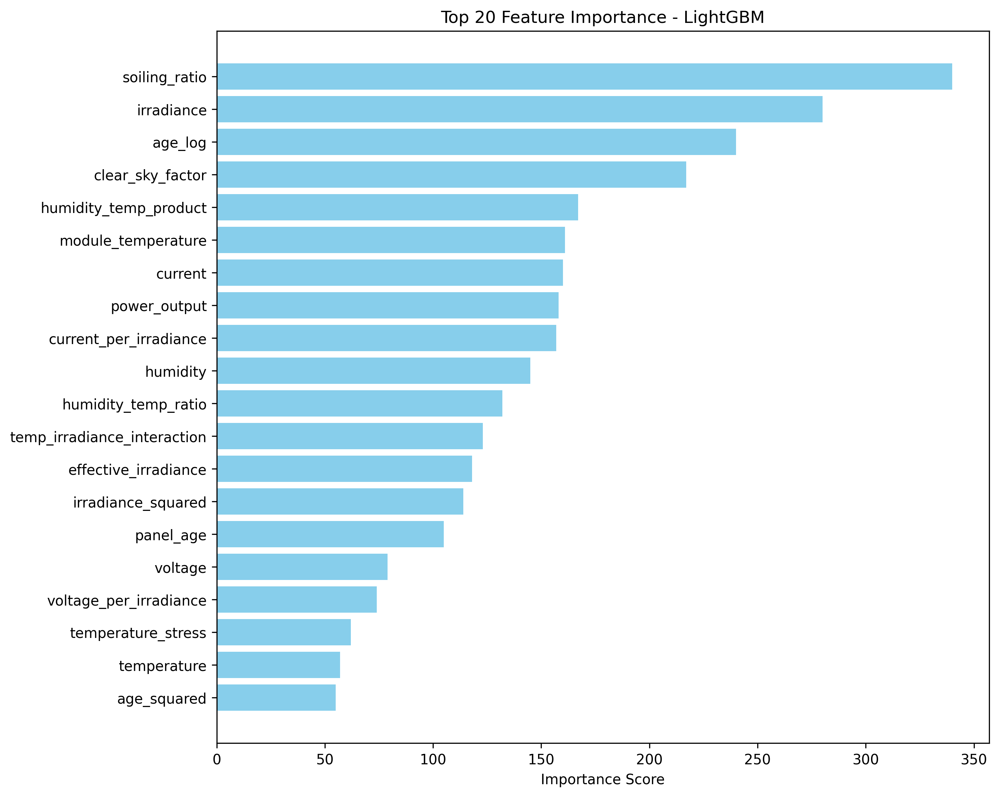

# Solar Panel Efficiency Modeling

This project is about understanding how solar panels really perform when you take them out of “ideal” lab conditions and put them in the messy real world. I worked with a dataset of about 20,000 training samples and 12,000 test samples that included measurements like irradiance, temperature, wind speed, humidity, voltage, and current.

Instead of just giving the data to a machine learning model and hoping for the best, I added some solar physics into the mix. For example:

- I corrected panel efficiency based on how far the temperature was from the standard 25 °C.
- I applied a −0.4% per °C temperature coefficient.
- I included soiling effects (dust and dirt reducing performance).
- I added a wind cooling factor to capture how airflow helps with heat dissipation.

By building these physics-based features, the models didn’t have to “guess” at basic principles, they could focus on learning the more subtle patterns.

# What’s inside the project:

    Here’s what the pipeline does step by step:

    1. Data preprocessing

    - Handles missing values and scales features.
    - Engineers new features like effective irradiance, power output (voltage × current), and environmental stress factors.

    2. Feature selection

    - Ranks features and filters out the least useful ones.
    - Exports a file with the ranking so you can see which variables matter most.

    3. Model training

    - You can pick either traditional models (linear regression, ridge, lasso, etc.) or ensemble models (random forest, gradient boosting, LightGBM).
    - The pipeline trains each model, saves its predictions, and scores it.

    4. Evaluation

    - Calculates metrics like R², RMSE, and MAE.
    - Generates residual plots, prediction vs. actual plots, and feature importance charts.
    - Saves a comparison table so you can see how the models stack up.

    5. Outputs

    - Results are neatly saved into a results folder.
    - You’ll find CSVs, JSONs, markdown reports, and plots, all organized for easy review.

**The pipeline also has support for hyperparameter tuning, though for this dataset the default settings already performed well because of the physics-informed features**

---

# Dataset

The dataset I used for this project is stored in the `data/raw/` folder of the repository. There are a couple of CSV files in there which hold the raw solar panel performance data that the models are trained and tested on.

The main CSV file includes both **environmental conditions** and **operational parameters** that influence solar panel efficiency. Some of the key columns are:

    - Solar irradiance (W/m²): how much sunlight is hitting the panel surface.
    - Ambient temperature (°C): the air temperature around the panel.
    - Panel temperature (°C): the actual panel temperature, which is more important than ambient because it directly affects electrical performance.
    - Humidity (%): included since high humidity can scatter incoming radiation.
    - Wind speed (m/s): helps with cooling the panels, indirectly boosting efficiency.
    - Time information: timestamps that capture day/night cycles and seasonal effects.
    - Efficiency (%): the target column we want to predict — it’s basically the ratio of electrical output to the incoming solar energy.

I didn’t do heavy manual cleaning since most of the preprocessing (handling missing values, scaling features, splitting into train/test) is already built into the pipeline. That way, if you replace the CSV with new data, the pipeline should still work.

## Why this dataset?

The reason I chose this dataset is because solar efficiency is a **nonlinear problem**. For example, high irradiance usually increases output, but when panel temperature also goes up, efficiency drops. ML models are good at capturing these kinds of competing effects.

---

# Models Used

I didn’t want to stick to just one algorithm because solar efficiency is influenced by a mix of linear and nonlinear factors. For example, irradiance and panel temperature interact in a nonlinear way, while wind speed might contribute in a more linear fashion. To capture this variety, I tested both **linear models** and **tree-based ensemble models**.

### Linear Models

- **Linear Regression:** the simplest baseline. It assumes efficiency depends on a straight-line combination of inputs.
- **Ridge Regression:** same as linear regression but with L2 regularization to prevent overfitting.
- **Elastic Net:** combines L1 and L2 regularization. It can both shrink coefficients and drop less relevant features.

### Tree-Based Models

- **Gradient Boosting:** builds an ensemble of shallow decision trees that correct each other’s errors. It’s powerful at capturing nonlinearities.
- **LightGBM:** a faster, more optimized version of boosting that works well on tabular data.
- **XGBoost:** another boosting algorithm, very popular in Kaggle-style competitions, and known for strong performance on structured datasets.

The idea was to see how much better the nonlinear models perform compared to the linear ones. As expected, the boosting-based models (Gradient Boosting, LightGBM, and XGBoost) gave significantly better predictions, which confirms that solar panel efficiency is not a purely linear phenomenon.

# How to run it:

This is a command-line tool.

First, open a terminal (on Windows this can be Command Prompt or PowerShell). Then navigate into the folder where you saved or cloned this project. You do that with the cd command, which means “change directory.” For example, if you saved this repo on your desktop, then run:

`cd Desktop\solar-panel-efficiency-ml`

On Mac/Linux it’s the same idea, just with forward slashes:

`cd ~/Desktop/solar-panel-efficiency-ml`

Once you're inside the folder, install all the required libraries/dependencies by typing:

`pip install -r requirements.txt`

Now, you can run the pipeline in two different modes depending on what you want to test.

If you run:

`python main.py --models traditional --verbose`

it’ll train the more “classic” models, things like linear regression, ridge, lasso, elastic net, decision trees, and so on. These are simpler, faster, and usually give you a good baseline to see how well your features are doing. In my case, these models actually did really well, because the physics-based features already explained a lot of the variation.

And if you run:

`python main.py --models ensemble --verbose`

then you’re asking it to train the heavier hitters, like random forest, gradient boosting, and LightGBM. These models usually shine when the data has complex non-linear patterns that a simple linear model can’t pick up. What was interesting here is that they didn’t really outperform the simpler ones, which basically proved the point that building good features mattered more than throwing in a fancy model.

**So the two commands are less about “which one is better” and more about comparing styles: the traditional run shows you how far you can get with straightforward models, and the ensemble run checks if the extra complexity is worth it. In this project, the answer was that the simple models held their ground**

# Results

All generated figures and outputs from this project are saved in the [`results/plots/`](results/plots/) folder.  
Below is a summary of the most important results, with their corresponding figures.

### Model Comparison

I compared multiple ML models (Linear Regression, Ridge, Elastic Net, Gradient Boosting, LightGBM, and XGBoost).

- The detailed interactive version is available as: [`results/plots/model_comparison.html`](results/plots/model_comparison.html).
- Gradient Boosting, LightGBM, and XGBoost consistently achieved higher accuracy compared to linear models.

### Feature Importance

Each model provides a ranking of which features are most important in predicting solar panel efficiency.

- **Elastic Net:**  
  

- **Gradient Boosting:**  
  

- **LightGBM:**  
  

- **Linear Regression:**  
  

- **Ridge Regression:**  
  

- **XGBoost:**  
  

Observation: Solar irradiance and ambient temperature dominate across all models, while secondary factors like humidity and wind speed vary in importance depending on the algorithm.

---

### Predictions vs Actual Efficiency

Scatter plots comparing predicted efficiency to actual values for each model.

- Ideal models produce points close to the diagonal line.
- Tree-based models (XGBoost, Gradient Boosting, LightGBM) outperform linear models, showing tighter clustering around the diagonal.

- **Elastic Net:**  
  

- **Gradient Boosting:**  
  

- **LightGBM:**  
  

- **Linear Regression:**  
  

- **Ridge Regression:**  
  

- **XGBoost:**  
  

---

### Residuals Analysis

Residual plots show the distribution of errors for each model.

- Good models should have residuals centered around zero with no obvious bias.
- Tree-based models again outperform linear ones, showing tighter, unbiased error distributions.

- **Elastic Net:**  
  

- **Gradient Boosting:**  
  

- **LightGBM:**  
  

- **Linear Regression:**  
  

- **Ridge Regression:**  
  

- **XGBoost:**  
  

---

# What I learned:

Physics-informed features beat brute force. Surprisingly, simple models like linear regression did just as well (sometimes better) than complex ensembles, because the features already captured the key physics.

Not every dataset needs a “fancy” model. LightGBM and random forest worked, but they didn’t outperform the linear baselines. That tells me the relationships were mostly linear once physics was included.

Reproducibility matters. I made sure the code saves all results, logs, and plots automatically so anyone can rerun it and get the same outputs.

# Why it matters:

Solar energy is booming, but performance prediction in real-world conditions is tricky. Even a modest improvement in predicting efficiency helps in designing systems, reducing costs, and planning maintenance. For me personally, this project was about bridging my materials engineering background with data science. It’s one thing to know the physics in theory, but applying it in a pipeline like this showed me how coding and domain knowledge can work hand in hand.

# Some physics assumptions:

- Standard Test Conditions (STC): 25 °C, 1000 W/m².

- Temperature coefficient: −0.4% per °C. This means every degree above 25 °C reduces efficiency by about 0.4%. That's a typical value for crystalline silicon.

- Soiling and wind cooling modeled as simple correction factors.

## 🙋 About This Project

I built this project as a way to learn how machine learning can be applied to renewable energy problems, specifically solar panel performance. My background is in materials engineering, but I’ve been working on broadening my skills in computational methods and data-driven approaches. This project was a chance to combine those interests and taking real-world data and applying different ML algorithms to see what works best.

It’s not meant to be a final, perfect solution for predicting solar panel efficiency, but rather a hands-on learning exercise that produced some useful insights. I wanted to compare linear models against boosting methods and confirm whether solar efficiency really is a nonlinear problem (it is, and the results showed that clearly).

More importantly, this project helped me understand the full pipeline: working with datasets, preprocessing, testing different models, evaluating them properly, and documenting the results. I see it as a portfolio piece that connects my interest in clean energy and my growing skills in computational and data science. My hope is that it also serves as a small demonstration of how machine learning can support sustainability research.
